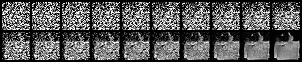

# 简介

参考 [1] 完成的基于 Pytorch 对 DDPM 的实现，当前使用的数据集是 FashionMNIST，可以改成其他数据集。

# 依赖包

```
python       3.8
pytorch      1.12
torchvision  0.13
einops       0.4
matplotlib   3.5
tqdm         4.64
```

# 文件

😁 train.py

定义超参数，固定随机数种子，定义 DDPM 中需要的 beta，alpha 等参数，定义训练数据，训练设备。开始训练，保存中间模型生成的图像，保存末代模型参数。

😁 varSchedule.py

定义各时间点 beta 的生成策略，包含 cosine，linear，quadratic，sigmoid。

😁 network.py

定义 \epsilon_theta 的估计模型，基于 Unet，中间是 resblock 和 attention 的交叉。

😁 loss.py

损失计算函数

😁 utils.py

一些有用的辅助函数。例如提取对应时间点参数的 extract，采样 q(x_t | x_0) 的 q_sample，采样 p(x_{t-1} | x_t, t) 的 p_sample 等。

😁 vis.py

独立文件，可视化前向扩散过程。

# 结果

一个中间训练结果：



# 参考

[1] [The Annotated Diffusion Model](https://huggingface.co/blog/annotated-diffusion)

